# AHASS Booking Servis

### Sistem Booking, Manajemen Kuota & Pelaporan Bengkel Honda

[](https://codeigniter.com)
[](https://www.mysql.com)
[](https://www.php.net)
[](https://jquery.com)
[](https://getbootstrap.com)
[](license.txt)

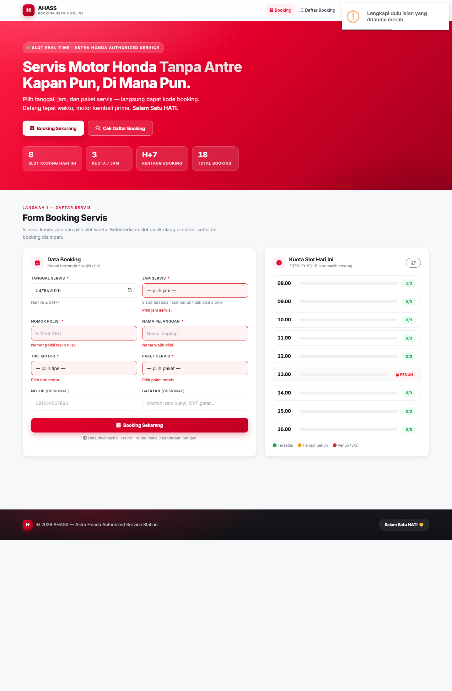

---

## Daftar Isi

1. [Tentang Sistem](#1-tentang-sistem)
2. [Fitur](#2-fitur)
3. [Tech Stack](#3-tech-stack)
4. [Kebutuhan Sistem](#4-kebutuhan-sistem)
5. [Cara Instalasi](#5-cara-instalasi)
6. [Konfigurasi Default](#6-konfigurasi-default)
7. [Cara Pakai](#7-cara-pakai)
8. [Data Demo & Cara Menguji Cepat](#8-data-demo--cara-menguji-cepat)
9. [Kontrak API](#9-kontrak-api)
10. [Desain Basis Data](#10-desain-basis-data)
11. [Hasil Pengujian](#11-hasil-pengujian)
12. [Pemenuhan Ketentuan Tugas](#12-pemenuhan-ketentuan-tugas)
13. [Struktur Folder](#13-struktur-folder)
14. [Catatan Teknis & Pemecahan Masalah](#14-catatan-teknis--pemecahan-masalah)

---

## 1. Tentang Sistem

Sistem ini dibangun untuk **AHASS (Astra Honda Authorized Service Station)** — unit layanan servis motor Honda — dengan satu tujuan sederhana: **pelanggan bisa mendaftar servis tanpa antre, dan petugas bengkel tahu persis apa yang akan terjadi hari ini.**

Sekilas, yang terlihat memang hanya sebuah form pendaftaran: pelanggan mengisi nomor polisi, nama, memilih tipe motor, jam, dan paket servis. Namun yang membedakan sistem ini dari form booking biasa adalah apa yang terjadi **setelah data masuk**:

- **Slot dijaga, bukan sekadar dicatat.** Satu jam servis hanya boleh diisi 3 kendaraan. Aturan ini dihitung di *server* — bukan dengan menyembunyikan pilihan di layar. Karena dihitung di dalam satu transaksi database yang mengunci baris, enam orang yang menekan tombol *Booking* pada saat yang sama pun tidak akan pernah membuat slot berisi 4 kendaraan. Pengujian paralel terhadap sistem ini selalu berakhir dengan hasil `1 menang · 5 ditolak · isi slot tepat 3/3`.
- **Pelanggan tidak menemui jalan buntu.** Ketika slot penuh, sistem tidak hanya menjawab "maaf, penuh". Sistem sekaligus menawarkan tiga jam terdekat yang masih kosong, dan satu klik langsung memindahkan pilihan jamnya.
- **Petugas bisa melihat, bukan menebak.** Indikator kuota per jam diperbarui otomatis, dashboard menampilkan grafik 7 hari terakhir dan *heatmap* okupansi 7 hari × 9 jam — warna merah berarti bengkel sudah penuh, hijau berarti masih longgar.
- **Pelaporan bukan urusan manual.** Rekap booking, pendapatan estimasi, okupansi rata-rata, sampai *breakdown* per paket servis dihitung otomatis oleh server, siap dicetak atau diunduh menjadi CSV dalam satu klik.
- **Administrasi turut terbantu.** Tersedia generator surat dinas (penawaran kerja sama, undangan, keterangan, permohonan) dengan kop AHASS, penomoran otomatis `AHASS/PKS/X/2026`, dan arsip yang bisa dibuka ulang kapan pun.

Jadi alih-alih hanya "form booking", sistem ini mencakup keseluruhan alur kerja bengkel: **pendaftaran → penjagaan kuota → pemantauan harian → pelaporan → administrasi surat.**

Seluruh ketentuan tugas terpenuhi: dibangun dengan **CodeIgniter 3** dan **MySQL**, antarmuka **HTML/CSS/JS + jQuery/AJAX** di atas **Bootstrap 5**, seluruh aksi data berjalan **tanpa reload halaman**, tanpa sistem login (sesuai ruang lingkup tugas), dan dilindungi CSRF sekaligus proteksi XSS. Aplikasi ini diuji berjalan di **Laragon** (Apache + MySQL + PHP).

---

## 2. Fitur

### Booking & Penjagaan Slot
- Form booking AJAX: nomor polisi, nama, tipe motor, tanggal, jam, paket servis, catatan, dan no. HP.
- Rentang pendaftaran dibatasi **hari ini sampai H+7**, baik di sisi klien maupun divalidasi ulang di server.
- **Kuota maksimal 3 kendaraan per jam.** Pelanggaran menghasilkan `HTTP 409` beserta pesan yang jelas.
- **Anti *race condition*:** pengecekan kuota dan penyimpanan data berada dalam satu transaksi dengan penguncian baris (`SELECT … FOR UPDATE`).
- **Booking ganda dicegah** — plat yang sama pada tanggal dan jam yang sama akan ditolak.
- Kode booking unik `AHASS-YYMMDD-XXXX` dibuat otomatis, disertai kartu konfirmasi dan struk siap cetak.

### Indikator Kuota Real-time
- Setiap slot menampilkan `0/3`, `1/3`, `2/3`, atau `PENUH`.
- Slot yang penuh otomatis menampilkan kunci dan **menjadi *disabled* pada dropdown jam**.
- Indikator menyegarkan diri setiap kali booking tersimpan atau status dibatalkan.

### Manajemen Booking
- Tabel daftar booking dengan filter tanggal, pencarian (plat / nama / kode booking), paket, dan status.
- Pagination server-side 10 baris per halaman, skeleton saat memuat, dan *empty state* yang informatif.
- Ubah status (`pending → dikonfirmasi → selesai`) dan batalkan booking dengan konfirmasi — pembatalan **mengembalikan kuota slot**.

### Dashboard Operasional
- Kartu statistik: booking hari ini, slot terisi, pendapatan estimasi, booking dibatalkan.
- Grafik booking 7 hari (Chart.js) dan **heatmap okupansi 7 hari × 9 jam** yang bisa diklik untuk melihat isi slot.
- Pencarian riwayat servis berdasarkan nomor polisi, lengkap dengan ringkasan jumlah kunjungan.

### Laporan Otomatis
- Filter rentang tanggal (default 7 hari terakhir) dengan rekap total booking, status, pendapatan estimasi, okupansi rata-rata, dan *breakdown* per paket.
- Seluruh angka dihitung lewat **agregasi query di server**.
- Tersedia **Cetak Laporan** (hanya isi laporan yang tercetak) dan **Export CSV** (siap dibuka di Excel).

### Generator Surat (FR-13)
- Empat template surat: Penawaran Kerja Sama, Undangan, Keterangan, Permohonan.
- Form variabel berubah otomatis mengikuti template terpilih, tanpa reload.
- Nomor surat dibentuk otomatis: `AHASS/[KODE]/[ROMAWI]/[TAHUN]`.
- Preview surat berkop AHASS dengan tanda tangan dan tempat stempel, tombol cetak, serta arsip riwayat.

### Ketahanan & Keamanan
- Token CSRF pada setiap permintaan POST, proteksi XSS pada seluruh penampilan data, dan *prepared statement* pada seluruh query.
- Mode production aktif (`ENVIRONMENT = production`) — *error* internal tidak pernah ditampilkan ke pengguna.
- Semua respon API berformat JSON, termasuk saat terjadi kesalahan.

---

## 3. Tech Stack

| Lapisan | Teknologi |
|---|---|
| Backend | CodeIgniter 3.1.13 (PHP MVC) |
| Basis data | MySQL 5.7+ / 8.x — InnoDB, foreign key, index |
| Frontend | HTML5, CSS3, JavaScript |
| Interaksi | jQuery 3.7 + AJAX (seluruh aksi tanpa reload) |
| UI | Bootstrap 5.3, FontAwesome 6, Google Fonts (Inter) |
| Grafik | Chart.js 4 |
| Konfirmasi | SweetAlert2 |
| Server pengujian | Laragon (Apache, MySQL, PHP 8) |

---

## 4. Kebutuhan Sistem

| Komponen | Minimum |
|---|---|
| PHP | 7.4 (dikembangkan & diuji pada PHP 8.x) |
| MySQL | 5.7 / 8.x |
| Ekstensi PHP | `mysqli` (bawaan), `mbstring` |
| Server | Laragon, XAMPP, atau Apache + PHP + MySQL lain |
| Browser | Chrome, Edge, Firefox (versi terbaru) |

> Catatan: nilai `date.timezone` pada `php.ini` sebaiknya sudah diisi (misalnya `Asia/Makassar`). Sistem memakai zona waktu server PHP dan MySQL untuk menentukan "hari ini".

---

## 5. Cara Instalasi

Langkah berikut memakai **Laragon**; untuk XAMPP caranya identik (hanya lokasi folder berbeda).

1. **Ambil source code**

   ```bash
   git clone https://github.com/<username>/<nama-repo>.git C:/laragon/www/ahass-booking
   ```

   Atau unduh sebagai ZIP, lalu ekstrak ke `C:\laragon\www\ahass-booking`.

2. **Nyalakan layanan** — buka Laragon, klik **Start All** (Apache dan MySQL harus berjalan).

3. **Buat database dan import skema**

   Buka **phpMyAdmin** (`http://localhost/phpmyadmin`), kemudian:
   - Buat database baru bernama `ahass_booking` dengan collation `utf8mb4_unicode_ci`.
   - Pilih tab **Import**, pilih file `database/schema.sql`, lalu **Go**.
   - Ulangi langkah yang sama untuk `database/seed.sql`.

   Dengan baris perintah (bila tersedia):

   ```bash
   mysql -u root --default-character-set=utf8mb4 < database/schema.sql
   mysql -u root --default-character-set=utf8mb4 < database/seed.sql
   ```

   > `--default-character-set=utf8mb4` penting agar data teks tidak rusak ketika diimpor lewat terminal Windows.

4. **Sesuaikan koneksi database** — buka `application/config/database.php`:

   ```php
   'hostname' => 'localhost',
   'username' => 'root',
   'password' => '',          // Laragon default tanpa password
   'database' => 'ahass_booking',
   ```

5. **Sesuaikan `base_url`** — buka `application/config/config.php`:

   ```php
   $config['base_url'] = 'http://localhost/ahass-booking/';
   ```

6. **Buka aplikasi** → `http://localhost/ahass-booking/`

   Halaman booking, tabel daftar, dashboard, laporan, dan generator surat sudah langsung terisi data demo.

---

## 6. Konfigurasi Default

| Item | Nilai |
|---|---|
| URL aplikasi | `http://localhost/ahass-booking/` |
| Host database | `localhost` |
| Nama database | `ahass_booking` |
| Username / password | `root` / *(kosong)* — bawaan Laragon |
| Jam operasional | 08.00 – 16.00 (9 slot per jam) |
| Kapasitas per slot | 3 kendaraan |
| Status booking | `pending`, `dikonfirmasi`, `selesai`, `dibatalkan` |

Aplikasi ini **sengaja tidak memiliki halaman login** sesuai ruang lingkup tugas — fokusnya ada pada alur booking, validasi slot, dan pelaporan.

---

## 7. Cara Pakai

Semua halaman saling terhubung lewat **menu navigasi di header** (bagian atas halaman): **Booking** (`/`), **Daftar Booking** (`/daftar`), **Dashboard** (`/dashboard`), **Laporan** (`/laporan`), dan **Surat** (`/surat`). Menu yang sedang dibuka ditandai dengan warna merah. Pada layar HP, menu tersembunyi di balik tombol ☰ di pojok kanan atas.

### 7.1. Mendaftarkan servis (pelanggan)

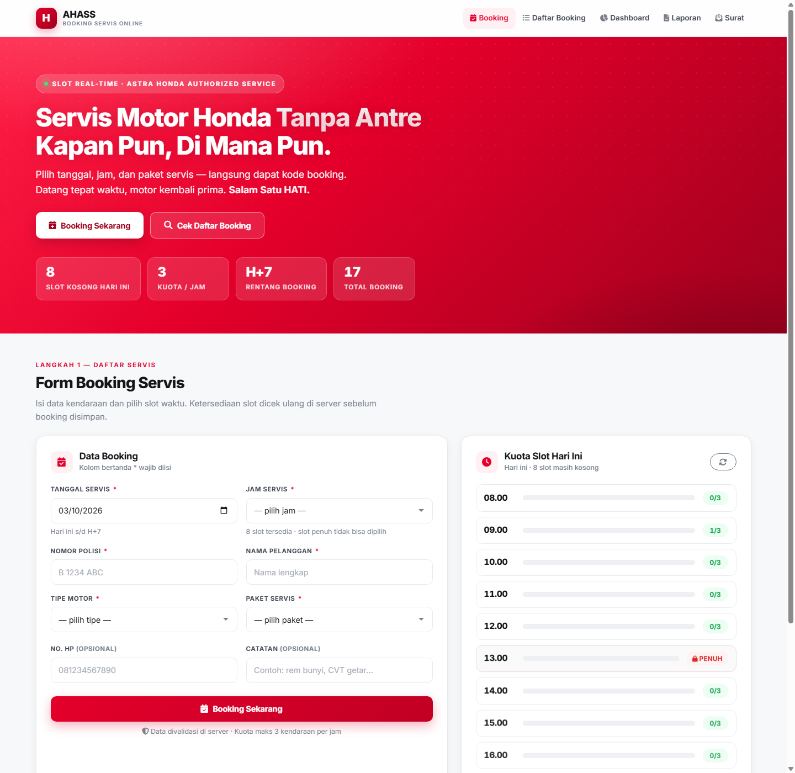

1. Buka halaman **Booking** (`/`). Panel di kanan menampilkan sisa kuota setiap jam hari ini.
2. Pilih **tanggal** (hanya hari ini sampai H+7). Daftar **jam** akan menyesuaikan sendiri — jam yang sudah penuh menampilkan tulisan `PENUH` dan tidak bisa dipilih.
3. Isi **nomor polisi, nama, tipe motor**, pilih **paket servis**, lalu tambahkan catatan atau no. HP bila perlu.
4. Klik **Booking Sekarang**. Halaman tidak ikut memuat ulang; muncul kartu konfirmasi berisi kode booking, misalnya `AHASS-261004-7F3A`.
5. Klik **Lihat Struk** bila ingin mencetak struk, atau **Booking Lagi** untuk pendaftaran berikutnya.

> Bila slot yang dipilih kebetulan baru saja terisi penuh, sistem menolak dengan pesan dan menawarkan tiga jam alternatif terdekat. Klik salah satunya, lalu kirim ulang.

### 7.2. Mengelola booking (petugas AHASS)

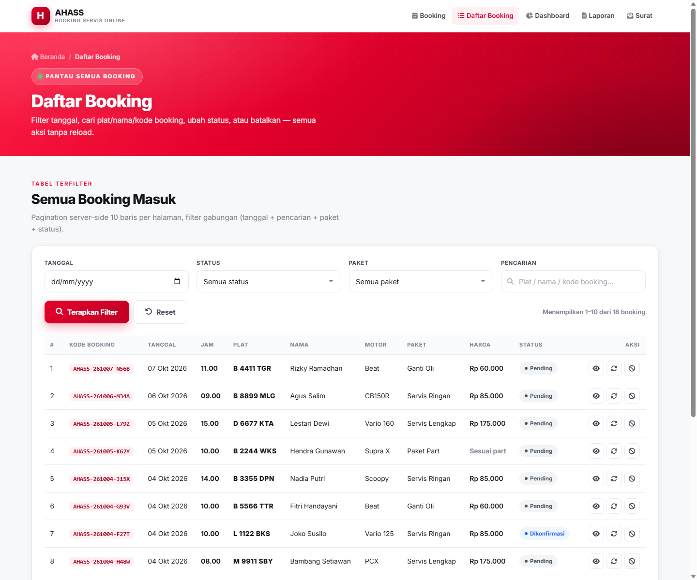

1. Buka **Daftar Booking** (`/daftar`).
2. Gunakan filter tanggal, pencarian (nomor polisi / nama / kode booking), paket, atau status untuk menyaring data.
3. Klik ikon **mata** pada baris untuk melihat detail lengkap, atau ikon **pensil** untuk mengubah status.
4. Alur status: `pending → dikonfirmasi → selesai`. Pembatalan selalu meminta konfirmasi karena **kuota slot otomatis kembali tersedia**.
5. Semua aksi berjalan lewat AJAX — tabel dan indikator slot langsung menyegarkan diri.

### 7.3. Membaca dashboard (`/dashboard`)

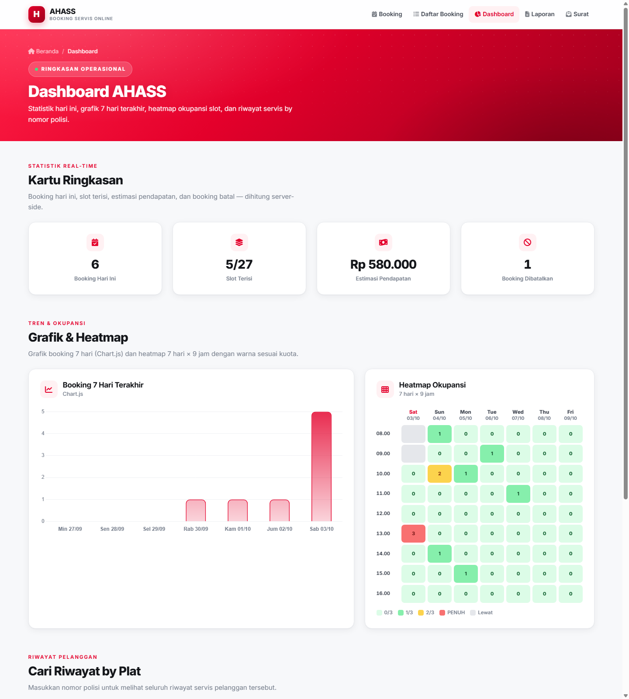

- **Kartu statistik** menampilkan angka hari ini.
- **Grafik 7 hari** memperlihatkan tren booking.
- **Heatmap** membaca okupansi 7 hari ke depan: hijau kosong, kuning 2/3, merah penuh, abu-abu jam yang sudah lewat. Klik satu kotak untuk melihat booking pada jam tersebut.
- **Cari riwayat by plat** berguna saat pelanggan lama datang kembali — masukkan nomor polisi, lalu tekan *Cari Riwayat*.

### 7.4. Membuat laporan (`/laporan`)

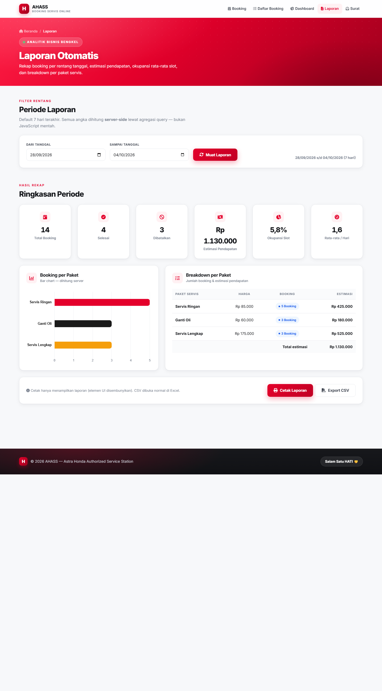

1. Atur rentang tanggal, lalu klik **Muat Laporan** (atau biarkan default 7 hari terakhir).
2. Periksa ringkasan: total booking, selesai, dibatalkan, estimasi pendapatan, okupansi, dan rata-rata harian.
3. Klik **Cetak Laporan** untuk versi cetak rapi, atau **Export CSV** untuk membuka di Excel.

### 7.5. Membuat surat (`/surat`)

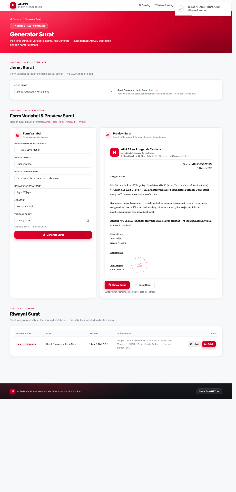

1. Pilih **jenis surat** — form variabel di bawahnya langsung berubah.
2. Isi variabel yang bertanda `*`, sesuaikan tanggal surat bila perlu.
3. Klik **Generate Surat**. Preview berkop AHASS muncul beserta nomor surat otomatis.
4. Klik **Cetak Surat** untuk mencetak. Surat tersimpan otomatis ke **Riwayat** dan bisa dibuka ulang lewat tombol *Lihat* atau *Cetak*.

---

## 8. Data Demo & Cara Menguji Cepat

`database/seed.sql` berisi data yang disusun agar seluruh skenario bisa dilihat dalam waktu kurang dari satu menit. Tanggal seed dihitung relatif terhadap `CURDATE()`, sehingga tetap relevan kapan pun dijalankan.

| Skenario pada seed | Kegunaan |
|---|---|
| **Hari ini jam 13.00 → 3/3 PENUH** | Dropdown jam menampilkan kunci + label PENUH |
| **Besok jam 10.00 → 2/3 terisi** | Booking satu lagi → langsung melihat **error 409** |
| Hari ini jam 11.00 → ada booking dibatalkan | Bukti kuota kembali tersedia setelah pembatalan |
| Varian status lengkap (4 status) | Badge warna dan filter status |
| ±18 booking, nama & plat realistis | Tabel, pagination, dan grafik langsung terlihat hidup |
| 4 paket servis + 4 template surat | Dropdown tidak kosong, generator surat langsung bisa dicoba |

### Membuktikan validasi slot penuh dalam 30 detik

1. Buka halaman Booking, ubah tanggal menjadi **hari ini**.
2. Lihat dropdown jam — `13.00` sudah bertanda **PENUH** dan tidak bisa dipilih (pembuktian di sisi tampilan).
3. Untuk pembuktian di sisi server, kirim booking ke jam yang sudah penuh (misalnya lewat DevTools pada `POST /api/booking/create`) dan amati balasannya:

   ```json
   {
     "success": false,
     "code": "SLOT_PENUH",
     "message": "Maaf, slot jam 13.00 sudah penuh (3/3). Silakan pilih jam lain.",
     "data": { "terisi": 3, "kapasitas": 3, "sisa": 0 },
     "alternatives": [
       { "jam": "12:00:00", "jam_label": "12.00", "sisa": 3 },
       { "jam": "14:00:00", "jam_label": "14.00", "sisa": 3 },
       { "jam": "11:00:00", "jam_label": "11.00", "sisa": 3 }
     ]
   }
   ```

### Skrip uji otomatis

Dua skrip disertakan untuk pengujian cepat dari terminal (sesuaikan URL bila berbeda):

```bash
bash database/test-api.sh     # alur booking, validasi, filter, kuota
bash database/test-race.sh    # TC-10: 6 request paralel ke slot sisa 1 kursi
```

Hasil pengujian race condition pada sistem ini selalu konsisten: **1 request berhasil (201), 5 ditolak (409), isi slot di database tepat 3/3.** Kedua skrip membersihkan datanya sendiri setelah selesai.

---

## 9. Kontrak API

Seluruh respon memakai JSON dengan header `Content-Type: application/json`.

| Method | Endpoint | Keterangan | Status |
|---|---|---|---|
| POST | `/api/booking/create` | Simpan booking | 201 sukses · 409 penuh/ganda · 422 validasi |
| GET | `/api/booking/list?tanggal=&q=&paket=&status=&page=` | Daftar booking terfilter + pagination | 200 |
| GET | `/api/booking/detail?id=` | Detail booking & data struk | 200 |
| POST | `/api/booking/update-status` | Ubah / batalkan status | 200 · 409 bila tidak sah |
| GET | `/api/slot?tanggal=` | Kuota tiap jam | 200 |
| GET | `/api/slot/heatmap` | Grid okupansi 7 hari × 9 jam (sekali panggil) | 200 |
| GET | `/api/paket` | Daftar paket servis | 200 |
| GET | `/api/report?dari=&sampai=` | Rekap laporan | 200 · 422 bila rentang salah |
| GET | `/api/riwayat?plat=` | Riwayat servis by nomor polisi | 200 |
| GET | `/api/dashboard/stats` | Statistik ringkas + data grafik | 200 |
| GET | `/api/surat/template` / `?id=` | Daftar template / daftar variabel | 200 |
| POST | `/api/surat/generate` | Render surat + simpan ke riwayat | 201 · 422 validasi |
| GET | `/api/surat/riwayat` / `?id=` | Arsip surat | 200 |

Endpoint yang tidak dikenal menghasilkan `404` dengan pesan `"Endpoint tidak ditemukan."`, sedangkan permintaan POST tanpa token CSRF ditolak dengan `403` berformat JSON.

---

## 10. Desain Basis Data

Skema lengkap tersedia di [`database/schema.sql`](database/schema.sql) dan data demo di [`database/seed.sql`](database/seed.sql).

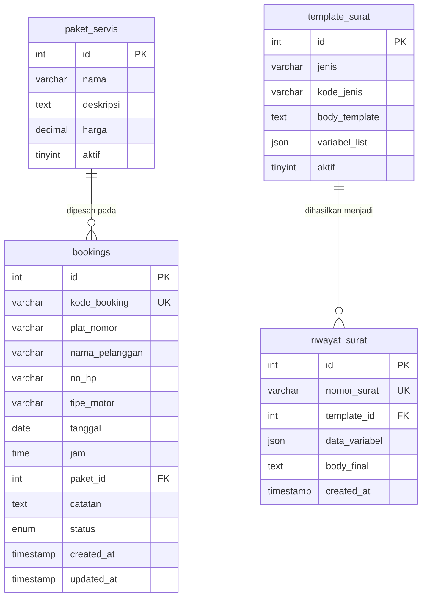

**Keputusan desain yang perlu dicatat:**

- `UNIQUE KEY uniq_slot_plat (tanggal, jam, plat_nomor)` — lapisan pertahanan terakhir terhadap booking ganda, selain validasi aplikasi.
- `INDEX idx_tanggal_jam (tanggal, jam)` — kunci agar validasi kuota dan *heatmap* tetap ringan meskipun data booking terus bertambah.
- Status `dibatalkan` tidak dihitung dalam kuota, sehingga pembatalan otomatis mengosongkan kembali slot.
- Kolom `variabel_list` dan `data_variabel` memakai tipe `JSON` agar template surat dapat diperluas tanpa mengubah struktur tabel.

---

## 11. Hasil Pengujian

Seluruh skenario berikut diuji langsung pada aplikasi yang berjalan — melalui interaksi di browser ( AJAX tanpa reload ) maupun pemanggilan endpoint.

| ID | Skenario | Hasil | Bukti singkat |
|---|---|---|---|
| TC-01 | Booking valid | **PASS** | Toast sukses + kode booking muncul, halaman tidak reload |
| TC-02 | Booking ke-4 pada slot penuh | **PASS** | HTTP **409** `SLOT_PENUH`, data tidak tersimpan |
| TC-03 | Dropdown slot penuh | **PASS** | Opsi `13.00 · 3/3 PENUH` menjadi `disabled` |
| TC-04 | Booking ganda (plat+tanggal+jam sama) | **PASS** | HTTP **409** `BOOKING_GANDA` + pesan jelas |
| TC-05 | Form kosong | **PASS** | 5 pesan validasi tampil, request tidak terkirim |
| TC-06 | Bypass validasi klien | **PASS** | Server menolak dengan **422** |
| TC-07 | Filter status/tanggal/paket | **PASS** | Tabel berubah via AJAX (contoh: 10 → 4 baris) |
| TC-08 | Pencarian plat/nama/kode | **PASS** | Kata kunci `B 1199 PSG` menghasilkan 2 data |
| TC-09 | Batalkan booking | **PASS** | Kuota berubah `1 → 0 → 1` setelah dibatalkan/dikembalikan |
| TC-10 | Race condition (6 request paralel) | **PASS** | `1 menang · 5 ditolak` — isi slot di DB **tepat 3/3** |
| TC-11 | Rentang tanggal (H+8, tanggal lewat, format salah) | **PASS** | Ketiganya ditolak **422** dengan pesan berbeda |
| TC-12 | XSS pada nama pelanggan | **PASS** | `<script>alert(1)</script>` tampil sebagai teks, tidak dieksekusi |
| TC-13 | Responsif 375 / 768 / 1280 px | **PASS** | 15 kombinasi halaman × lebar, tanpa *overflow* horizontal |
| TC-14 | Cetak struk | **PASS** | Hanya struk yang tercetak; header & tabel tersembunyi |
| TC-15 | Repo & dokumentasi | **PASS** | `schema.sql`, `seed.sql`, README ini, dan screenshots tersedia |
| TC-16 | Saran slot alternatif saat penuh | **PASS** | 409 menyertakan 3 jam kosong terdekat |
| TC-17 | Laporan + cetak + CSV | **PASS** | Angka konsisten dengan data; cetak & unduhan berfungsi |
| TC-18 | Heatmap 7 hari | **PASS** | 63 sel (7 × 9) + legenda; klik sel membuka daftar booking |
| TC-19 | Riwayat by plat | **PASS** | Plat ada → ringkasan tampil; plat tak dikenal → pesan ramah |
| TC-20 | Generate surat valid | **PASS** | Kop, nomor `AHASS/PKS/X/2026`, tanggal, dan isi tampil |
| TC-21 | Form variabel dinamis | **PASS** | Ganti template → jumlah & label variabel berubah otomatis |
| TC-22 | Variabel kosong | **PASS** | Validasi tampil, request tidak terkirim |
| TC-23 | Cetak surat | **PASS** | Hanya isi surat yang masuk area cetak |
| TC-24 | Riwayat surat | **PASS** | Surat tersimpan, bisa dibuka ulang dan dicetak lagi |

Pengujian tambahan yang dilakukan di luar tabel di atas:

- Waktu respons seluruh endpoint berada di kisaran **47–84 ms**.
- Semua halaman (`/`, `/daftar`, `/dashboard`, `/laporan`, `/surat`) mengembalikan `200`, endpoint tak dikenal `404` dengan JSON rapi.
- Error CSRF menghasilkan `403` berformat JSON, bukan halaman HTML.

---

## 12. Pemenuhan Ketentuan Tugas

| # | Ketentuan | Status | Implementasi |
|---|---|---|---|
| 1 | Form: Plat, Nama, Tipe Motor, Jam, Paket | ✅ | Halaman Booking — seluruh field sesuai spek, plus tanggal, catatan, dan no. HP |
| 2 | Validasi slot maksimal 3 di backend, error via AJAX | ✅ | `Booking_model::buat()` dengan transaksi + `FOR UPDATE`; respon `409` JSON |
| 3 | Tabel list booking + filter | ✅ | `/daftar` — filter tanggal, pencarian, paket, status + pagination server-side |
| 4 | jQuery / AJAX tanpa reload | ✅ | Submit, filter, ubah status, laporan, dan surat semuanya AJAX |
| 5 | CodeIgniter 3 | ✅ | Struktur MVC: `controllers`, `models`, `views`, `config` |
| 6 | MySQL | ✅ | Database `ahass_booking` — InnoDB, FK, index |
| 7 | Schema SQL tersedia | ✅ | `database/schema.sql` dan `database/seed.sql` |
| 8 | README berisi instruksi menjalankan | ✅ | Dokumen ini |
| — | HTML/CSS/JS + Bootstrap 5 | ✅ | Tema khusus AHASS di atas Bootstrap 5.3 |
| — | Kode booking unik + halaman konfirmasi/struk | ✅ | Format `AHASS-YYMMDD-XXXX`, kartu konfirmasi, struk cetak |
| — | Rentang booking hari ini s/d H+7 | ✅ | Validasi klien (`min`/`max`) dan server |
| — | Tanpa login (sesuai ruang lingkup) | ✅ | Sengaja di luar scope |
| — | Aman dari CSRF & XSS | ✅ | Token CSRF per POST, escaping output, prepared statement |
| — | Desain responsif | ✅ | Diuji pada 375, 768, dan 1280 px |
| — | Fitur pembeda: laporan, saran alternatif, heatmap, riwayat by plat | ✅ | Semua terpasang dan teruji |
| — | Mode produksi tanpa traceback error | ✅ | `ENVIRONMENT = production` |
| — | Repo GitHub public | ⏳ | Dilakukan saat pengumpulan |

---

## 13. Struktur Folder

```
ahass-booking/
├── application/
│   ├── controllers/
│   │   ├── Welcome.php            # Halaman Booking           → /
│   │   ├── Daftar.php             # Daftar Booking            → /daftar
│   │   ├── Dashboard.php          # Dashboard                 → /dashboard
│   │   ├── Laporan.php            # Laporan                   → /laporan
│   │   ├── Surat.php              # Generator Surat           → /surat
│   │   ├── Notfound.php           # 404 (JSON untuk API, halaman untuk URL biasa)
│   │   └── api/
│   │       ├── Booking.php        # create, list, detail, update-status
│   │       ├── Slot.php           # kuota per jam + heatmap
│   │       ├── Report.php         # rekap laporan
│   │       ├── Riwayat.php        # riwayat by plat
│   │       ├── Dashboard.php      # statistik ringkas
│   │       ├── Paket.php          # daftar paket
│   │       └── Surat.php          # template, generate, riwayat surat
│   ├── models/
│   │   ├── Booking_model.php      # inti bisnis: kuota, transaksi, laporan
│   │   ├── Paket_model.php
│   │   └── Surat_model.php
│   ├── views/
│   │   ├── layout/header.php, footer.php
│   │   ├── partials/page-head.php
│   │   ├── pages/booking.php, daftar.php, dashboard.php, laporan.php, surat.php, 404.php
│   │   └── errors/
│   ├── core/
│   │   ├── MY_Controller.php      # helper respon JSON
│   │   └── MY_Exceptions.php      # seluruh error API → JSON
│   └── config/                    # routes, database, config, csrf
├── assets/
│   ├── css/app.css                # tema AHASS (merah Honda, responsif, print)
│   └── js/app.js                  # seluruh logika AJAX
├── database/
│   ├── schema.sql                 # struktur tabel
│   ├── seed.sql                   # data demo
│   ├── test-api.sh                # pengujian endpoint
│   └── test-race.sh               # pengujian race condition
├── screenshots/                   # tangkapan layar halaman & responsif
├── index.php
├── PRD.md
└── README.md
```

### Tangkapan Layar

| | |
|---|---|
| 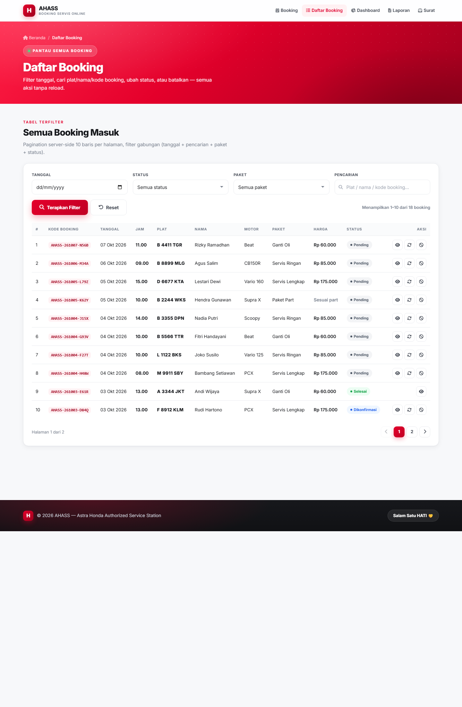 | 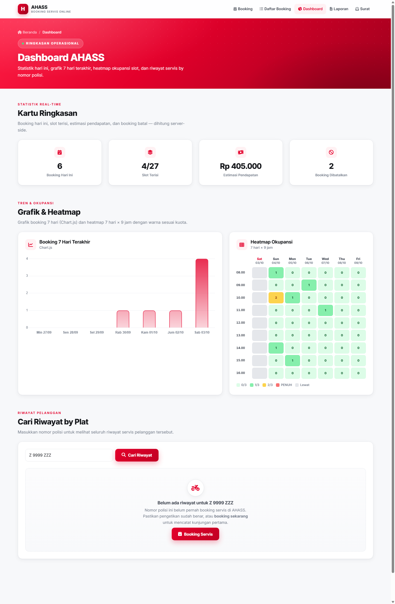 |
| **Daftar Booking** — filter, badge status, aksi | **Dashboard** — statistik, grafik, heatmap |
| 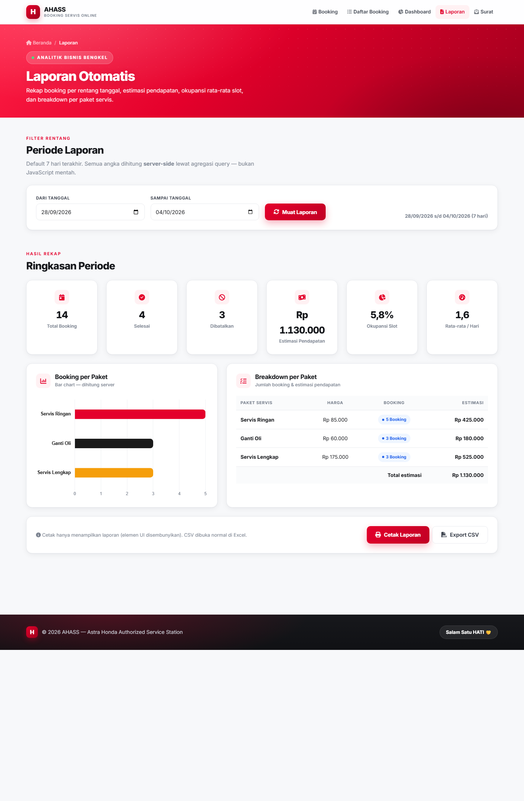 | 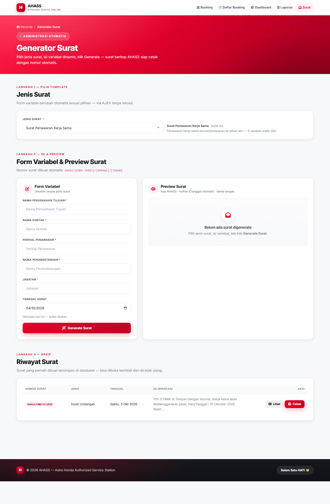 |
| **Laporan** — rekap & ekspor | **Generator Surat** — preview berkop |
| | |
| 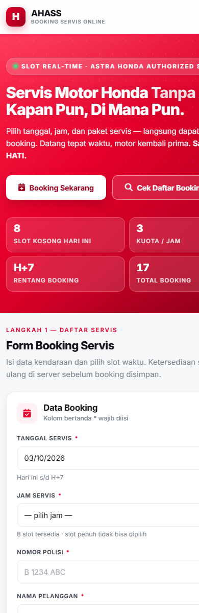 | 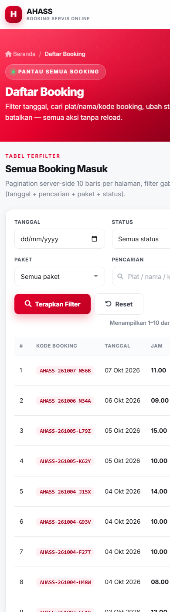 |
| Tampilan 375 px — form satu kolom & slot 2 kolom | Tabel men-scroll horizontal dengan kolom Plat menempel |

Tangkapan layar seluruh kombinasi lebar (375 / 768 / 1280 px) tersedia di folder [`screenshots/responsive/`](screenshots/responsive/).

---

## 14. Catatan Teknis & Pemecahan Masalah

**Tampilan terasa belum diperbarui setelah mengubah file CSS/JS.**
Setiap perubahan pada `assets/css/app.css` atau `assets/js/app.js` disertai peningkatan versi pada URL (`?v=…`) sehingga browser mengunduh berkas terbaru. Bila masih terlihat lama, lakukan muat ulang keras dengan `Ctrl + F5`.

**Tanggal pada aplikasi berbeda dengan tanggal sistem.**
Aplikasi memakai zona waktu PHP dan MySQL. Isi `date.timezone` di `php.ini` dengan zona waktu lokal agar "hari ini" sesuai harapan.

**Aplikasi menampilkan halaman kosong.**
Pastikan Apache dan MySQL menyala, database `ahass_booking` sudah di-import, dan kredensial di `application/config/database.php` benar.

**Mengembalikan data demo.**
Jalankan ulang `database/seed.sql` kapan pun — file ini bersifat idempoten (mengosongkan dan mengisi ulang data demo dengan tanggal relatif terhadap hari ini).

**Mode pengembangan.**
Untuk melihat pesan error PHP selama pengembangan, ubah kembali `index.php`:

```php
define('ENVIRONMENT', isset($_SERVER['CI_ENV']) ? $_SERVER['CI_ENV'] : 'production');
//                                             ganti 'production' → 'development'
```

---

Dibangun untuk pemenuhan tugas pemrograman web — **Sistem Booking Servis AHASS**.
Terima kasih, salam satu HATI. 🤝
